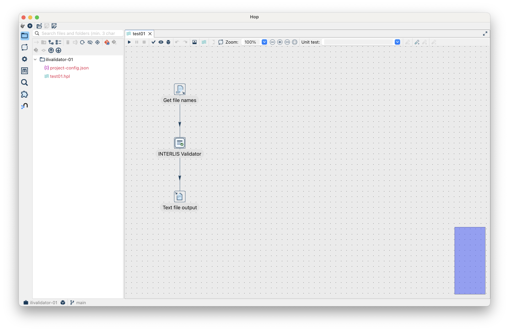
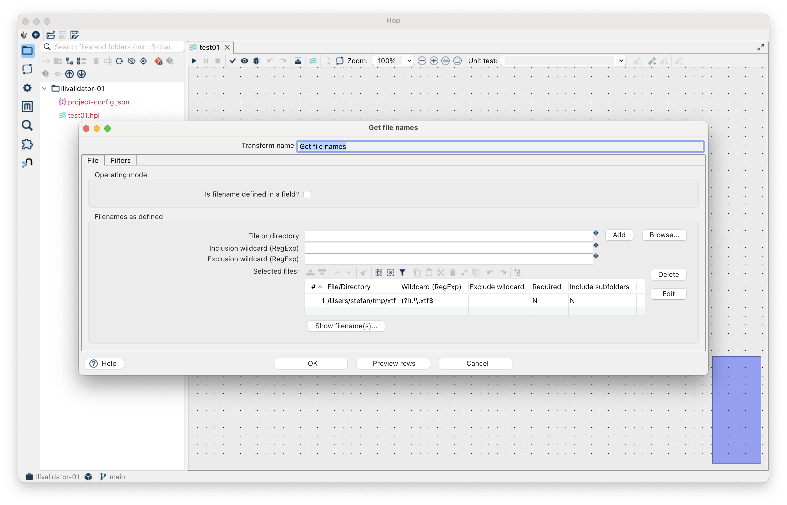
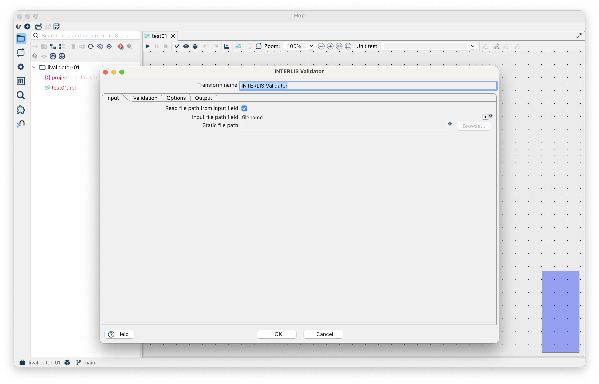
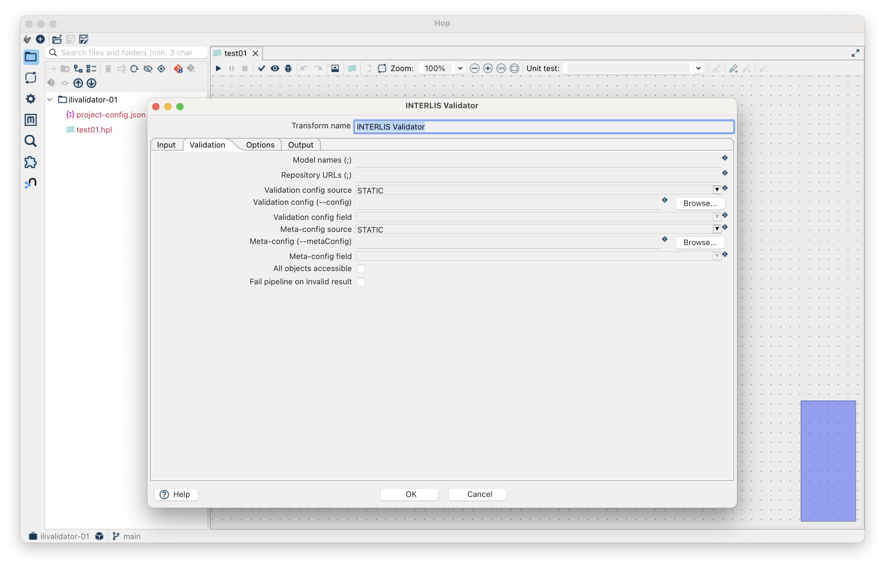
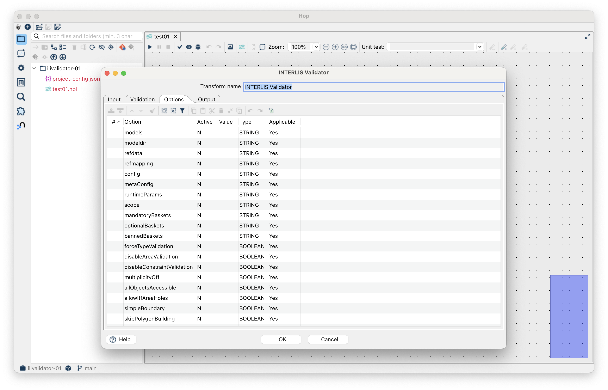
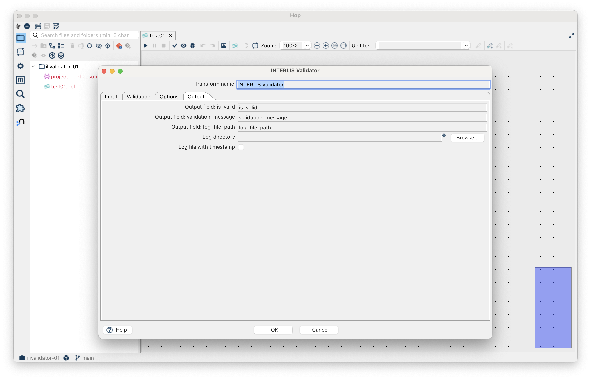
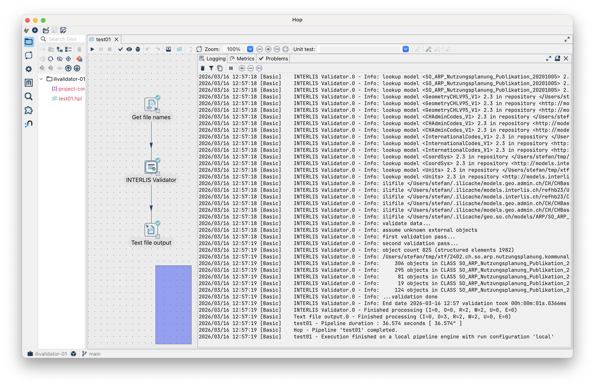

---
= Let's Hop #4 - Ich möchte Teil einer Validierung sein
Stefan Ziegler
2026-03-16
:thoth-type: post
:thoth-status: published
:thoth-tags: interlis, apache hop, hop, java, ilivalidator
:idprefix:
---
Nach `ili2db` ist vor `ilivalidator`: https://github.com/edigonzales/hop-ilivalidator-plugin. Wahrlich nichts Grossartiges aber ohne geht es natürlich nicht. Auch hier das Beispiel, das alle XTF aus einem Verzeichnis liest und diese einzeln prüft:

Mit dem &laquo;Get file names&laquo; Transformer lesen wir alle INTERLIS-Transferdateien aus einem Verzeichnis:

Und dann kommt bereits das ilivalidator-Plugin:

Der erste Tab scheint mir noch harmlos zu sein. Natürlich kann man den Dateinamen entweder als statischen Text eingeben oder aus einem Field. Im zweiten Tab wird es interessanter:

Mit den beiden Optionen `--config` und `--metaConfig` kann man entweder statisch oder dynamisch oder via `ilidata:xxx` ein &laquo;Prüfprofil&laquo; angeben und muss sich nicht um die vielen Optionen und Validierungsmodellen etc. kümmern.

Der dritte Tab beinhaltet alle möglichen Optionen, um notfalls manuell eingreifen zu können:

Im letzten Tab kann man noch das Logfile und die optionalen Output-Felder bestimmen:

Ein erfolgreicher Run sieht so aus:

Was noch nicht implementiert ist, ist die Plugin-Unterstützung. Mich beschleicht ein Gefühl, dass es hier wieder zu Classloader-Issues kommt und nicht einfach mit dem Exponieren der Option gemacht ist. Irgendwie wird es schon gehen und muss es auch, das https://www.youtube.com/watch?v=izQB2-Kmiic&list=RDizQB2-Kmiic&start_radio=1[DMAV wartet...]

Probiert es aus und meldet Fehler. Das https://github.com/edigonzales/hop-distributions/releases[Komplettpaket] wurde mit dem ilivalidator-Plugin upgedatet.

[source,bash,linenums]
----
HOP_JAVA_HOME=/Users/stefan/.sdkman/candidates/java/25.0.1-tem \
HOP_OPTIONS="--enable-native-access=ALL-UNNAMED -Xmx2048m" \
./hop-gui.sh
----