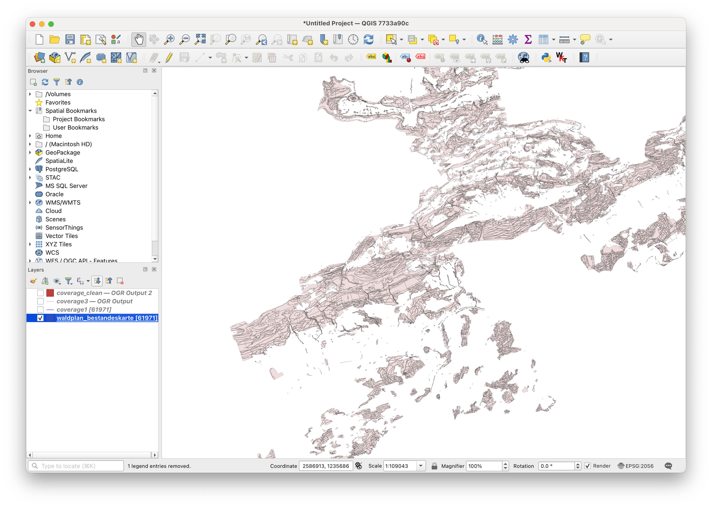
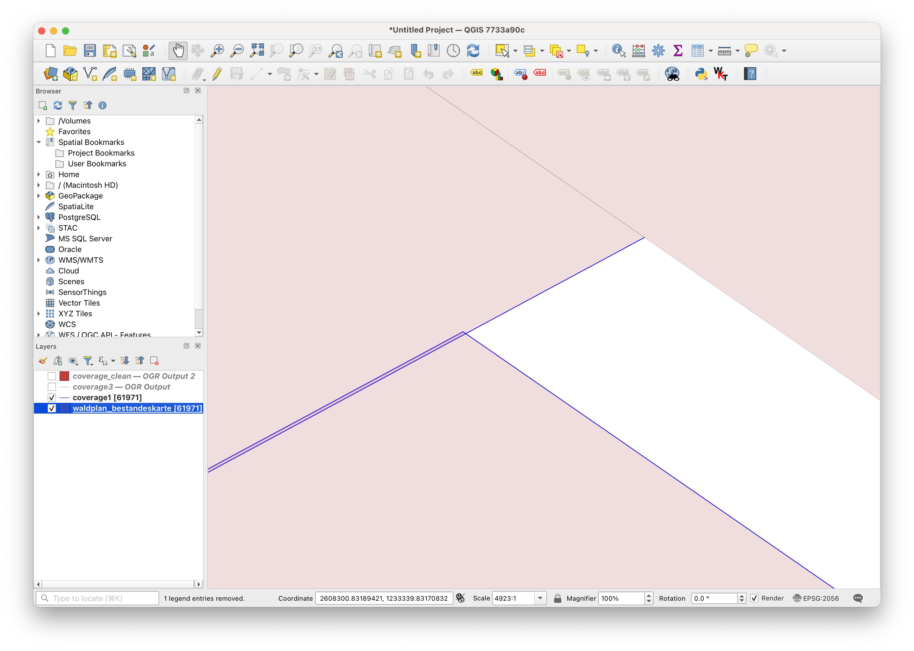
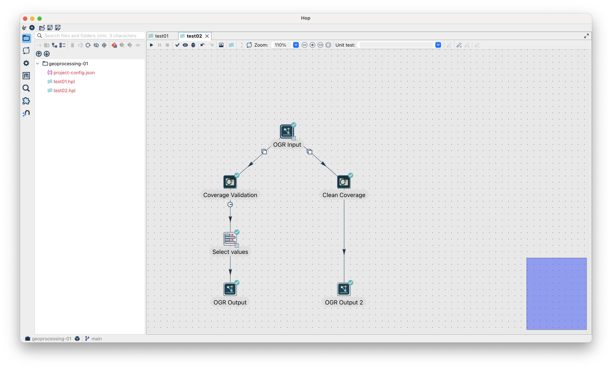
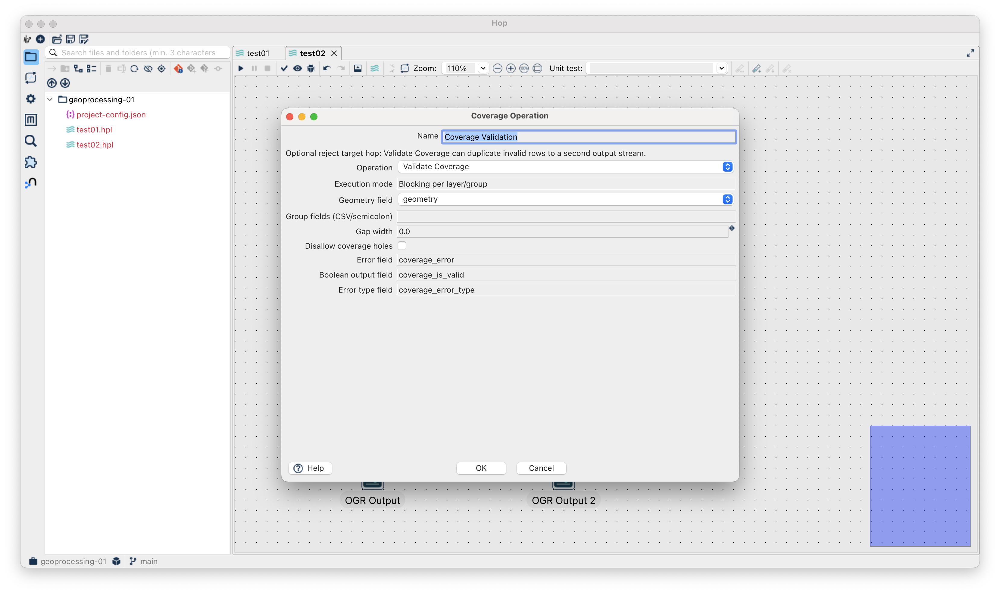
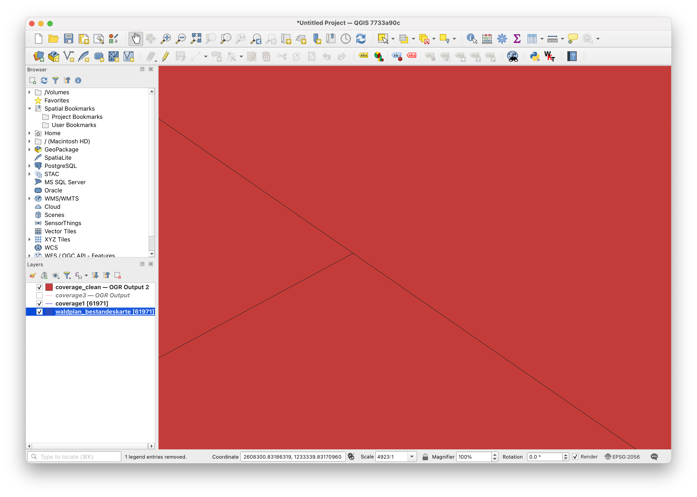

---
= Let's Hop #5 - Geometrien bearbeiten, Layer vergleichen, Coverages prüfenº
Stefan Ziegler
2026-03-17
:thoth-type: post
:thoth-status: published
:thoth-tags: apache hop, hop, java, spatial, geoprocessing
:idprefix:
---
In diesem fünften Teil meiner kleinen Serie zu Apache-Hop-Plugins geht es um das https://github.com/edigonzales/hop-geoprocessing-plugin[hop-geoprocessing-plugin]. Das Plugin bündelt Geoverarbeitung für Apache Hop in fünf Transform-Familien: Geometry Operation, Spatial Predicate, Layer Overlay, Layer Aggregate und Coverage Operation.

**Geometry Operation:**

Die Familie _Geometry Operation_ ist der grosse Werkzeugkasten für einzelne Geometrien. Sie arbeitet mit einem Input-Layer, umfasst 34 Operationen und verwendet das Ausführungsmodell Streaming. Das bedeutet: Es wird Zeile für Zeile gearbeitet, ohne den ganzen Layer zu puffern. Im RAM bleibt im Wesentlichen nur die aktuelle Zeile. Typische Beispiele sind Buffer, Centroid, Vereinfachung, Geometrie-Bereinigung oder ähnliche Bearbeitungsschritte auf Einzelfeatures.

**Spatial Predicate:**

Die Familie _Spatial Predicate_ arbeitet mit einem Primary Input und einem Secondary Layer. Es gibt 9 Operationen. Technisch wichtig ist: Der Secondary Layer wird zuerst vollständig eingelesen, im RAM gehalten und anschliessend mit einem STRtree auf den Envelopes indiziert. Erst danach beginnt die Verarbeitung der Primary Rows. Entsprechend ist der Secondary Layer möglichst früh zu reduzieren.

**Layer Overlay:**

Die Familie _Layer Overlay_ deckt klassische GIS-Fälle wie Intersection, Clip, Erase oder Identity ab, insgesamt umfasst sie 4 Operationen und arbeitet ebenfalls mit primary + secondary input, ist technisch aber blocking per layer. Im RAM liegen dabei der vollständige Secondary Layer, ein STRtree auf dem Secondary Layer und optional zusätzlich eine Union-Geometrie des Secondary Layers. Es gibt hier auch die Berechnungsvariante `FIXED_PRECISION`, welche uns in PostGIS einiges besser dünkt, als die bisherige Variante.

**Layer Aggregate:**

Die Familie _Layer Aggregate_ arbeitet mit einem Input-Layer und optionaler Gruppierung. Es gibt 4 Operationen (Dissolve- oder Collect-artige Operationen). Sie ist blocking per layer/group, also gerade nicht streaming. Stattdessen werden alle Zeilen eines Layers oder einer Gruppe gepuffert, bevor das Resultat emittiert wird.

**Coverage Operation:**

Die Familie _Coverage Operation_ ist für Polygon-Coverages (INTERLIS-Area lässt grüssen) gedacht, umfasst 5 Operationen und arbeitet mit einem Input-Layer und optionaler Gruppierung und ist ebenfalls blocking per layer/group. Im RAM liegt der gesamte Layer oder die aktive Gruppe, ergänzt um den Zustand, den Coverage-weite Validierung oder Simplifizierung benötigt.

Kleines Beispiel gefällig? Machen wir gleich Nägel mit Köpfen und prüfen das Coverage &laquo;Waldplan&raquo; und bereinigen allfällige Fehler. Der Waldplan besteht aus 61'971 Polygonen. 

Die Bearbeitung hat einiges gesehen: _GRASS GIS_, PostGIS, _FME_, _ArcGIS_ und einen Bezugsrahmenwechsel durchgemacht. Entsprechend gibt es auch kleinere Unschönheiten wie Überlappungen und Löcher:

Meine Apache Hop Pipeline sieht so aus:

Einerseits prüfe ich den Waldplan, ob es Überlappungen gibt und gleichzeitig bereinige ich allfällige Überlappungen. Beide Resultate speichere ich in einer GeoPackage-Datei. Der Validator schreibt Linien-Geometrien (die betroffenen Linien-Segmente) und nicht einen exakten Ort.

Die beiden Transformer sind mehr oder weniger selbsterklärend:

Das Resultat kann sich sehen lassen. Zuerst ein Beispiel eines gefundenen Fehlers (die blauen Linien) und anschliessend die bereinigten Geometrien:

Das Ganze dauerte für beide Prozesse insgesamt 30 Sekunden.

Probiert es aus und meldet Fehler. Das https://github.com/edigonzales/hop-distributions/releases[Komplettpaket] wurde mit dem geoprocessing-Plugin upgedatet.

[source,bash,linenums]
----
HOP_JAVA_HOME=/Users/stefan/.sdkman/candidates/java/25.0.1-tem \
HOP_OPTIONS="--enable-native-access=ALL-UNNAMED -Xmx2048m" \
./hop-gui.sh
----

So, ich habe fertig. خلاص. 

Oder vielleicht doch nicht ganz? Einige Ideen habe ich noch (Geometrie-Feldrechner, Python 3 Skripte einbinden, `gdal_translate` etc. und Ideen für Hop Server), aber nun brauchts eine Pause und ich will die gröbsten Bugs ausmisten, wenn ich bei Gelegenheit Apache Hop verwende und dann will ich mir auch noch was bezüglich guter Dokumentation überlegen.