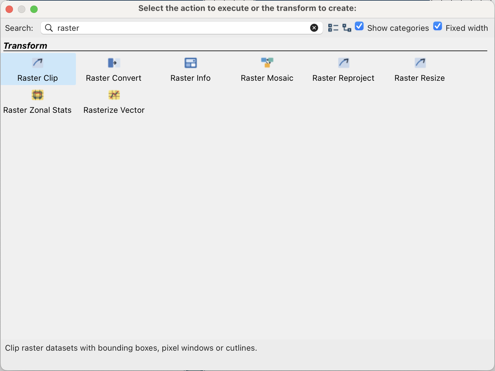
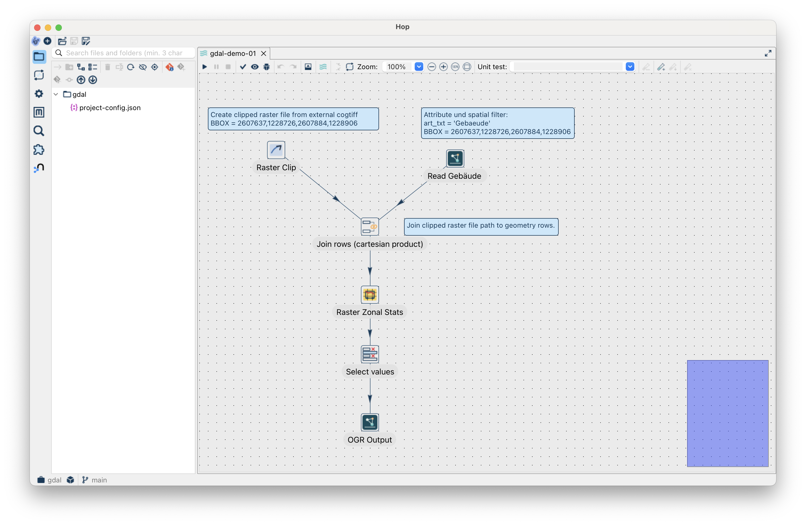
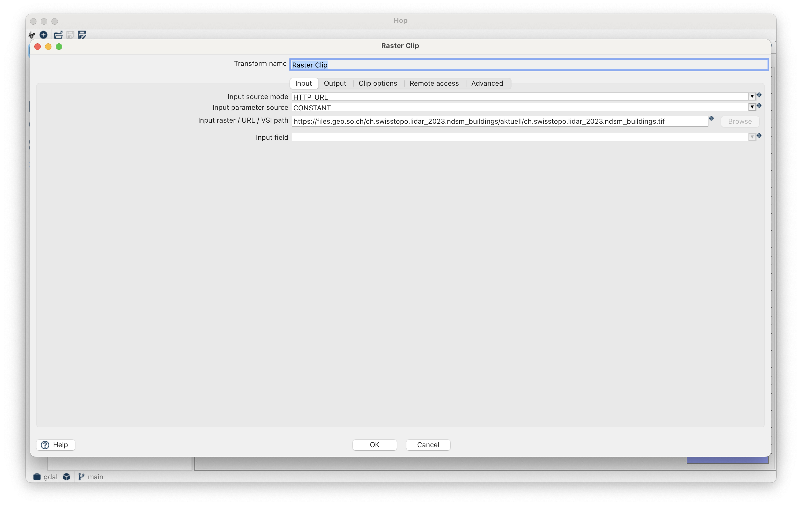
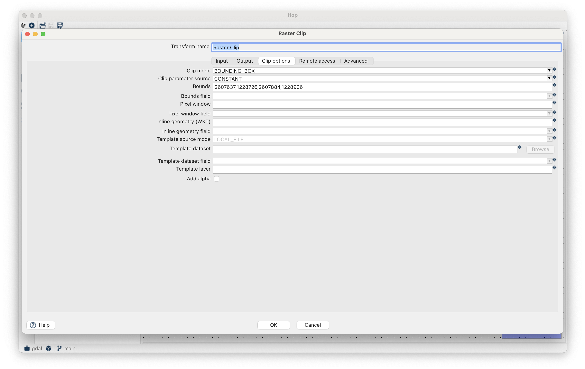
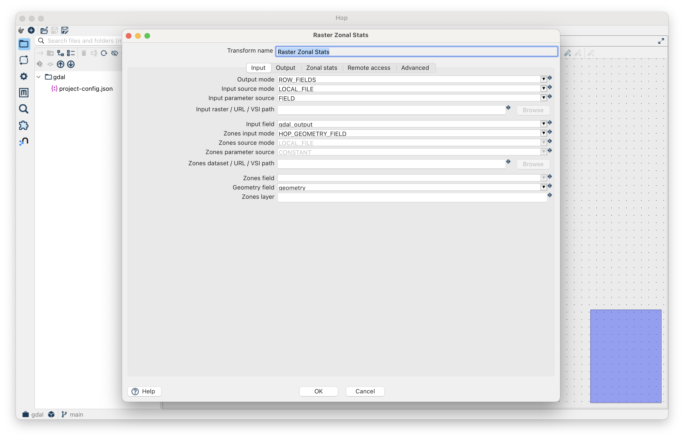
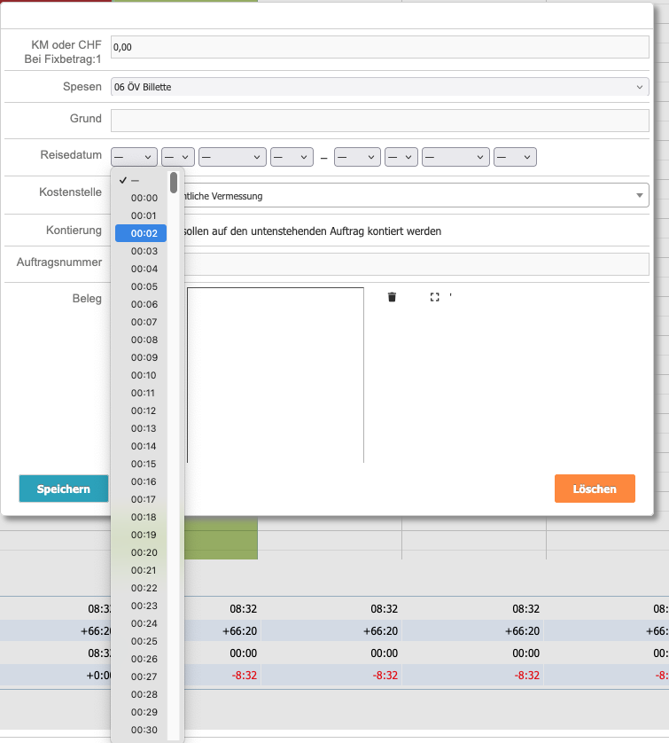
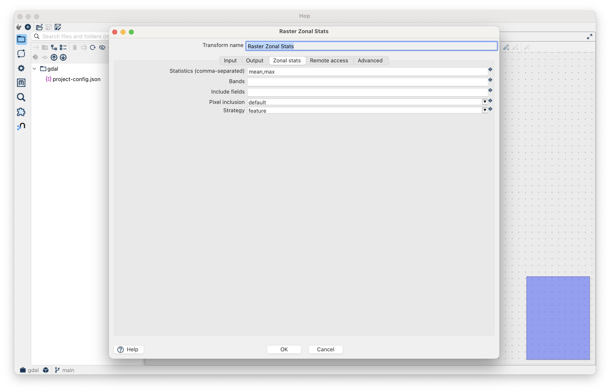
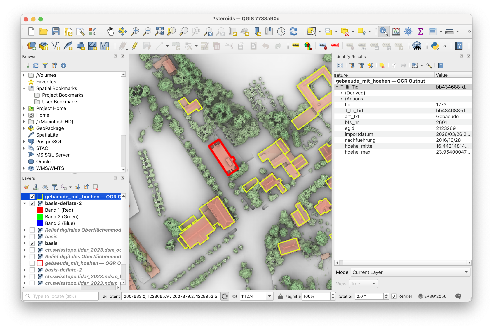

---
= Let's Hop #6 - Pixel für Pixel
Stefan Ziegler
2026-03-30
:thoth-type: post
:thoth-status: published
:thoth-tags: apache hop, hop, java, spatial, gdal
:idprefix:
---
Was wäre ein Spatial-ETL ohne Rasterunterstützung? Wir haben die https://github.com/edigonzales/gdal-java-bindings[_gdal-java-bindings_] und das https://github.com/edigonzales/hop-gdal-plugin/[_hop-gdal-plugin_], das bis jetzt &laquo;nur&raquo; einen OGR-Input- und -Output-Transform bereitstellt. Wenn wir Rasterprocessing in Apache Hop wollen, müssen wir uns überlegen, wie wir das strukturieren. Ich habe mich entschieden, mich an der Struktur der https://gdal.org/en/stable/programs/gdal_raster.html[neuen GDAL-Tools] zu orientieren. D.h. nicht mehr ein `gdal_translate` und `gdalwarp`, die fast alles können und vor Optionen nur so strotzen, sondern &laquo;do one thing and do it well&raquo;.

Et voilà, neu gibt es im _hop-gdal-plugin_ folgende Raster-Transforms:

Als Beispiel will ich für unser Bürogebäude die Höhe berechnen:

Als erstes lese ich mit einem OGR-Input-Transform die Gebäude eines bestimmten Ausschnittes aus einer GeoPackage-Datei. Gleichzeitig clippe ich mit dem Raster Clip Transform von einer extern gehosteten Cloud Optimized GeoTIFF-Datei (mit den Gebäudehöhen aus LiDAR-Daten) den gleichen Ausschnitt und speichere die Datei temporär:

Weil der Raster Clip Transform nur eine einzige Row zurückliefert, können wir mit dem Stream aus dem OGR-Input einfach das kartesische Produkt bilden, damit erhält jede Row des OGR-Inputs auch den Pfad der temporären, geclippten Rasterdatei. Anschliessend können wir diesen Stream mit dem Raster Zonal Stats Transform verbinden. Das GUI dieses Transforms (und auch anderer) ist noch verbesserungswürdig und irgendwie verwirrend (was ist hier was?). Erstes weil einfach schlecht strukturiert und zweites hat es wirklich viele Optionen und Möglichkeiten, weil vieles auch aus seinem Field eines Streams übernommen werden kann:

Es fehlt in https://eclipse.dev/eclipse/swt/[_SWT_] so etwas wie der https://developer.mozilla.org/en-US/docs/Web/HTML/Reference/Elements/details[`
`]-Tag in HTML. Aber hey, es geht noch schlimmer und ich denke da an das Leuchturmprojekt (Zeit- und Leistungserfassung) der &laquo;digitalen Transformation&raquo; im Kanton:

Ich meine, wer um Herrgottswillen kommt auf eine solche Idee?! Aber egal, weiter mit Apache Hop.

In diesem Transform sind alle Statistiken gemäss dem https://gdal.org/en/stable/programs/gdal_raster_zonal_stats.html[GDAL-Rastertool möglich]. Wir wählen Durchschnitt und Maximum (pro Gebäude):

Eine Berechnungsvariante in diesem Transform ist Row-By-Row (Geometrie für Geometrie im Stream). Anschliessend entfernen wir noch ein paar Attribute aus dem Stream und speichern die Daten in einer GeoPackage-Datei mit dem OGR-Output-Transform. Das Resultat:

Probiert es aus und meldet Fehler. Das https://github.com/edigonzales/hop-distributions/releases[Komplettpaket] wurde mit dem verbesserten GDAL-Plugin upgedatet. Und das kostet euch gar nichts. Nicht mal ein https://www.linkedin.com/feed/update/urn:li:activity:7439758001986719745?commentUrn=urn%3Ali%3Acomment%3A%28activity%3A7439758001986719745%2C7442848881903624192%29&dashCommentUrn=urn%3Ali%3Afsd_comment%3A%287442848881903624192%2Curn%3Ali%3Aactivity%3A7439758001986719745%29[Kafi/Gipfeli] pro Tag. Wow.

[source,bash,linenums]
----
HOP_JAVA_HOME=/Users/stefan/.sdkman/candidates/java/25.0.1-tem \
HOP_OPTIONS="--enable-native-access=ALL-UNNAMED -Xmx2048m" \
./hop-gui.sh
----
